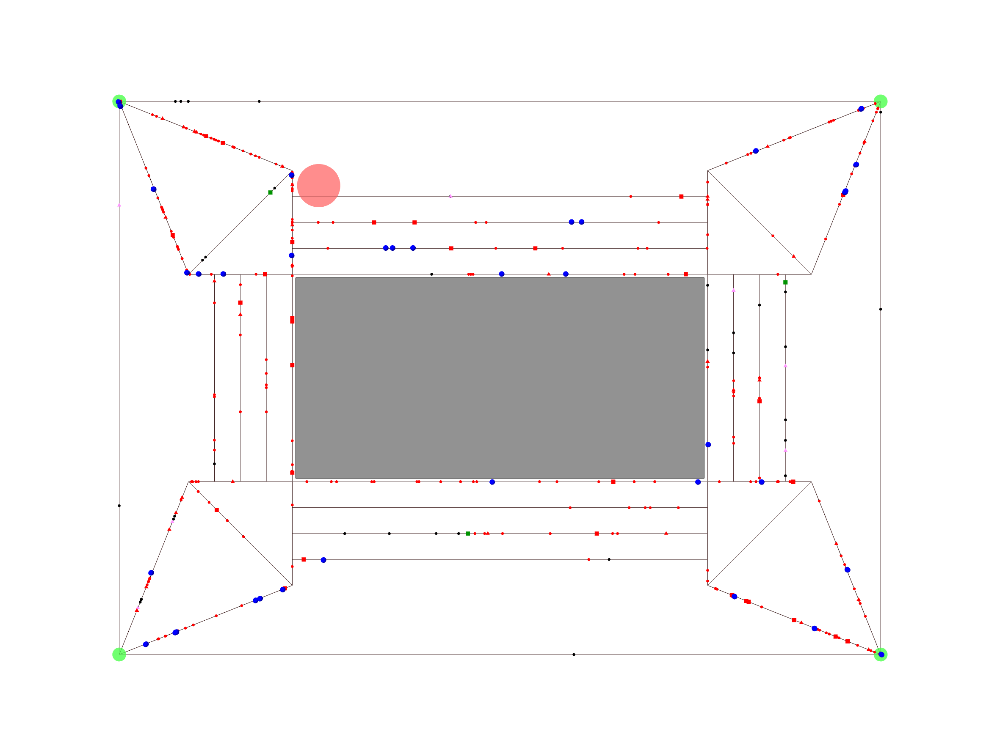

    <h1>Crowd Evacuation Dynamics at Sporting Events</h1>
    <h3>Authors: Christian Faccio, Javier Arribas González, Luis Bernabeu Agüeria, Imanol Jurado Martínez, Bruno Sancho Deltell</h3>
    <h6>Our project focuses on the simulation and analysis of crowd evacuation behavior and dynamics during sporting events using agent-based modelling. Each agent represents an individual spectator with autonomous decision-making capabilities, potentially including more sophisticated dynamics like stadium geometry or police agents. 

The objectives include spotting bottlenecks in stadium emergency exits, analyzing crowd behavior to better improve stadiums' geometry and evaluate how factors like staff guidance and crowd management protocols impact evacuation efficiency and safety.</h6>

---

   

